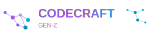

<div align="center">
  
  <br />
  
  <h1>CodeCraft Gen‑Z</h1>
  <p><strong>Plataforma moderna para criar, lançar e evoluir apps — com pagamentos, licenças e experiências de ponta.</strong></p>
  <a href="https://codecraftgenz.com.br" target="_blank"><b>🌐 codecraftgenz.com.br</b></a>
  <br /><br />
  <a href="https://github.com/Ricar66/codecraftgenz/actions/workflows/main_codecraftgenz.yml">
    
  </a>
  
  
  
  
</div>

---

## Sobre a Empresa
- ✨ A CodeCraft Gen‑Z conecta talentos e tecnologia para transformar ideias em software real.
- 🧭 Foco em experiências, performance e segurança para apps web e desktop.
- 🤝 Parcerias e mentorias para acelerar projetos do zero ao lançamento.

## O Projeto
- ⚛️ Frontend em `React` com `Vite` e estratégias de performance.
- 🚀 API `Node.js/Express` com pagamentos (`Mercado Pago`), licenças e webhooks.
- 🗄️ Banco de dados `Azure SQL` com migrações automáticas e auditoria.
- 🛡️ Segurança: `Helmet`, `CORS`, `JWT`, rate‑limit e sanitização.

## Demonstração
- Página principal: `https://codecraftgenz.com.br`
- Apps e compras: `https://codecraftgenz.com.br/apps`
- Downloads seguros: rotas protegidas e URLs de integridade

## Destaques
- 💳 Checkout com Mercado Pago, verificação de status e webhooks de confirmação.
- 🔐 Ativação de licença por hardware e trilha de auditoria de eventos.
- 📦 Upload de executáveis com entrega via `/downloads/:file` e checagem de integridade.
- 📈 Telemetria opcional com Application Insights.

## Como Executar
```bash
npm install
npm run dev       # Frontend em http://localhost:5173
npm start         # API em http://localhost:8080 (requer .env)
```

## Variáveis de Ambiente
Defina em `.env` conforme o ambiente. Não exponha segredos.

```ini
# Frontend
VITE_APP_ENV=development
VITE_DEBUG=true
VITE_WP_API_URL=https://cms.codecraftgenz.com.br/wp-json

# API / Server
PORT=8080
ALLOWED_ORIGINS=http://localhost:5173
JWT_SECRET=...
ADMIN_RESET_TOKEN=...

# Banco (Azure SQL)
DB_SERVER=...
DB_USER=...
DB_PASSWORD=...
DB_DATABASE=...

# Mercado Pago
MERCADO_PAGO_ACCESS_TOKEN=...
MERCADO_PAGO_PUBLIC_KEY=...
MERCADO_PAGO_SUCCESS_URL=https://codecraftgenz.azurewebsites.net/apps/:id/compra
MERCADO_PAGO_FAILURE_URL=https://codecraftgenz.azurewebsites.net/apps/:id/compra
MERCADO_PAGO_PENDING_URL=https://codecraftgenz.azurewebsites.net/apps/:id/compra
MERCADO_PAGO_WEBHOOK_URL=https://codecraftgenz.azurewebsites.net/api/apps/webhook
```

## Scripts
- `npm run dev` – inicia o frontend
- `npm run build` – build de produção
- `npm run preview` – serve o build localmente
- `npm start` – inicia a API
- `npm run test` – executa testes

## Segurança
- Não commitar segredos
- Gere um `JWT_SECRET` forte:
```bash
node -e "console.log(require('crypto').randomBytes(32).toString('base64'))"
```

## Contato
- 🌐 Site: `https://codecraftgenz.com.br`
- ✉️ Comercial: `contato@codecraftgenz.com.br`
- 🐛 Issues e suporte via GitHub
