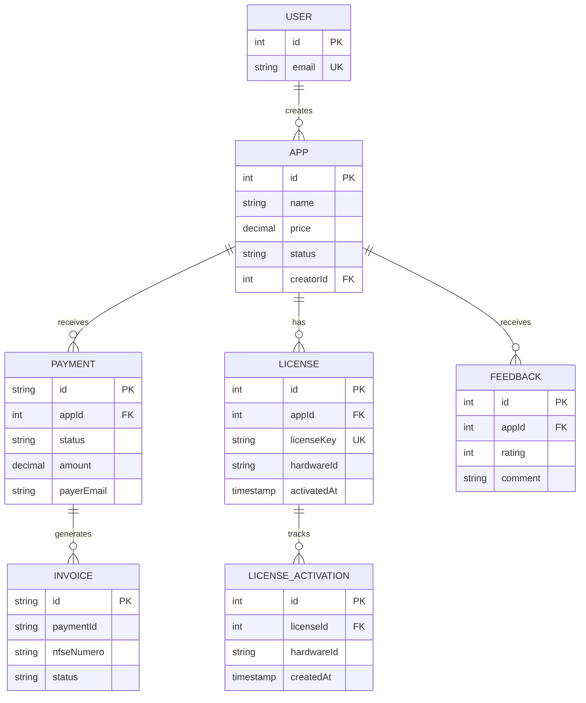
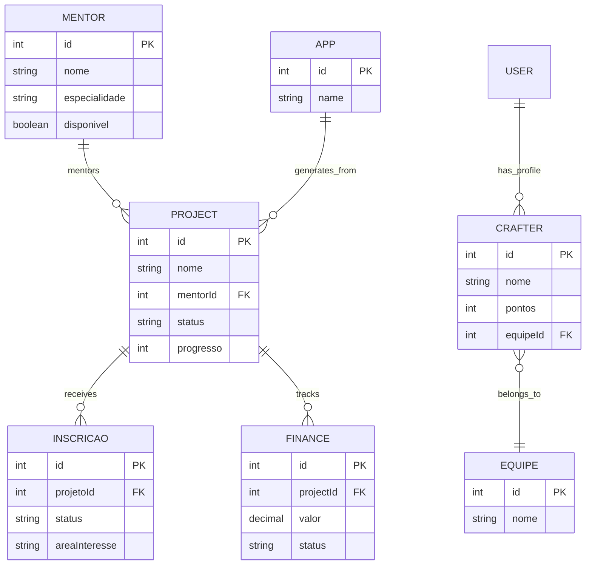
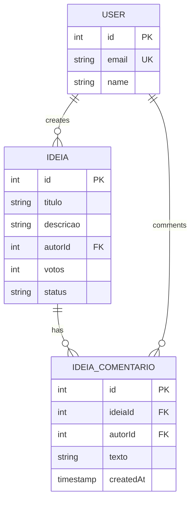
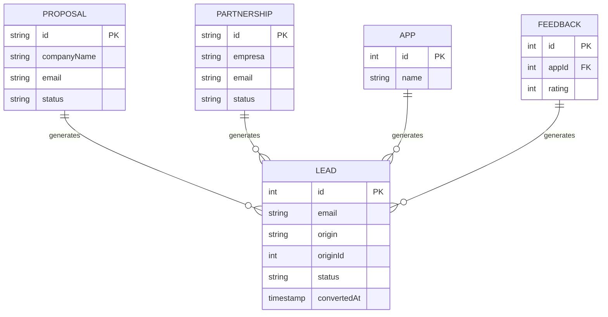
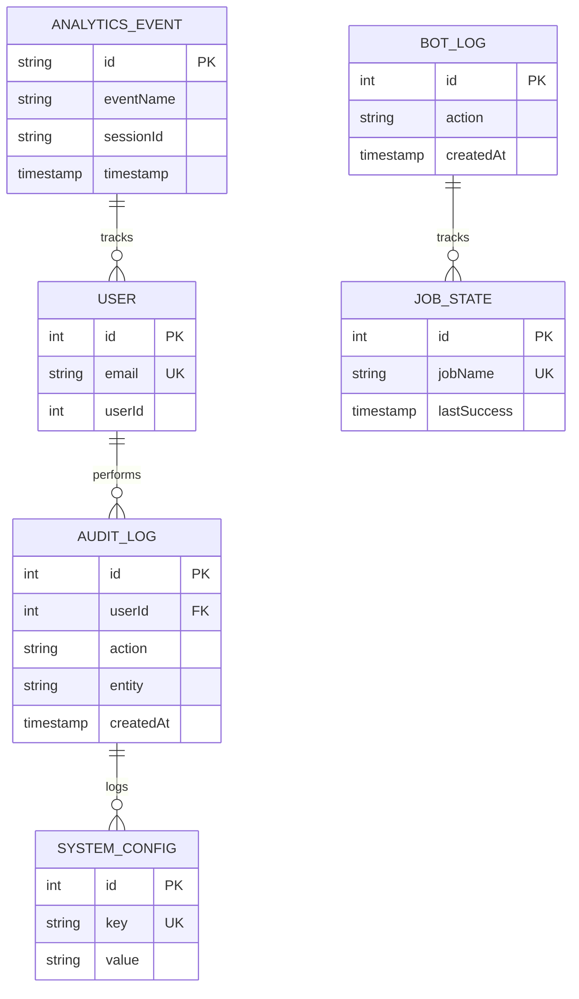

# DER - Diagrama Entidade Relacionamento

Diagrama completo das entidades e relacionamentos do CodeCraft Gen-Z em notação Mermaid.

---

## Visão Geral Completa

```mermaid
erDiagram

    %% ============================================
    %% USERS & AUTHENTICATION
    %% ============================================
    USER ||--o{ PASSWORD_RESET : issues
    USER ||--o{ APP : creates
    USER ||--o{ PAYMENT : makes
    USER ||--o{ LICENSE : owns
    USER ||--o{ FEEDBACK : gives
    USER ||--o{ CHALLENGE_SUBMISSION : submits
    USER ||--o{ DISCORD_LINK : has
    USER ||--o{ META : creates
    USER ||--o{ META_ASSIGNEE : assigned_to
    USER ||--o{ META_OBSERVATION : comments
    USER ||--o{ CRAFTER : has_profile
    
    %% ============================================
    %% MARKETPLACE
    %% ============================================
    APP ||--o{ PAYMENT : has
    APP ||--o{ LICENSE : has
    APP ||--o{ FEEDBACK : has
    APP ||--o{ PROJECT : generates_from
    
    %% ============================================
    %% PAYMENTS & LICENSES
    %% ============================================
    LICENSE ||--o{ LICENSE_ACTIVATION : has
    
    %% ============================================
    %% PROJECTS
    %% ============================================
    PROJECT ||--o{ MENTOR : assigned_to
    PROJECT ||--o{ INSCRICAO : receives
    PROJECT ||--o{ FINANCE : has
    
    %% ============================================
    %% CRAFTERS & TEAMS
    %% ============================================
    CRAFTER ||--o{ RANKING_TOP3 : appears_in
    CRAFTER }o--|| EQUIPE : belongs_to
    
    %% ============================================
    %% CHALLENGES
    %% ============================================
    DESAFIO ||--o{ CHALLENGE_SUBMISSION : has
    
    %% ============================================
    %% IDEIAS & COMMUNITY
    %% ============================================
    IDEIA ||--o{ IDEIA_COMENTARIO : has
    
    %% ============================================
    %% METAS & CALENDAR
    %% ============================================
    META ||--o{ META_ASSIGNEE : assigns
    META ||--o{ META_OBSERVATION : receives
    
    %% ============================================
    %% ENTITIES
    %% ============================================
    
    USER {
        int id PK
        string email UK
        string name
        string passwordHash
        string role
        string status
        boolean mfaEnabled
        string mfaSecret
        boolean isGuest
        boolean onboardingCompleted
        string interestsJson
        timestamp createdAt
        timestamp updatedAt
    }

    PASSWORD_RESET {
        int id PK
        int userId FK
        string email
        string tokenHash UK
        timestamp expiresAt
        timestamp usedAt
        timestamp createdAt
    }

    DISCORD_LINK {
        int id PK
        int userId FK UK
        string discordId UK
        string discordUsername
        string discordAvatar
        string accessToken
        string refreshToken
        timestamp tokenExpiresAt
        boolean crafterRoleAssigned
        timestamp linkedAt
        timestamp updatedAt
    }

    APP {
        int id PK
        string name
        string description
        string shortDescription
        decimal price
        string category
        string tags
        string thumbUrl
        string screenshots
        string executableUrl
        string platforms
        string version
        string status
        boolean featured
        string licenseType
        int downloadCount
        int creatorId FK
        int projectId FK
        timestamp createdAt
        timestamp updatedAt
    }

    PAYMENT {
        string id PK
        int appId FK
        int userId FK
        string preferenceId UK
        string status
        decimal amount
        decimal unitPrice
        int quantity
        int installments
        string currency
        string payerEmail
        string payerName
        string mpResponseJson
        timestamp createdAt
        timestamp updatedAt
    }

    LICENSE {
        int id PK
        int appId FK
        int userId FK
        string email
        string hardwareId
        string licenseKey UK
        string appName
        timestamp activatedAt
        timestamp createdAt
        timestamp updatedAt
    }

    LICENSE_ACTIVATION {
        int id PK
        int appId FK
        string email
        string hardwareId
        int licenseId FK
        string action
        string status
        string message
        string ip
        string userAgent
        timestamp createdAt
    }

    FEEDBACK {
        int id PK
        int userId FK
        int appId FK
        int rating
        string comment
        timestamp createdAt
        timestamp updatedAt
    }

    PROJECT {
        int id PK
        string nome
        string owner
        string descricao
        string status
        decimal preco
        int progresso
        string dataInicio
        string thumbUrl
        string tagsJson
        int mentorId FK
        timestamp createdAt
        timestamp updatedAt
    }

    MENTOR {
        int id PK
        string nome
        string email
        string telefone
        string bio
        string especialidade
        string avatarUrl
        string linkedinUrl
        string githubUrl
        boolean disponivel
        timestamp createdAt
        timestamp updatedAt
    }

    INSCRICAO {
        int id PK
        string nome
        string email
        string telefone
        string redeSocial
        string cep
        string cidade
        string estado
        string areaInteresse
        string mensagem
        int projetoId FK
        string tipo
        string status
        string notas
        timestamp createdAt
        timestamp updatedAt
    }

    CRAFTER {
        int id PK
        string nome
        string email
        string bio
        string avatarUrl
        string githubUrl
        string linkedinUrl
        string skillsJson
        int pontos
        boolean active
        int equipeId FK
        int userId FK UK
        timestamp createdAt
        timestamp updatedAt
    }

    EQUIPE {
        int id PK
        string nome
        string descricao
        string logoUrl
        string status
        timestamp createdAt
        timestamp updatedAt
    }

    RANKING_TOP3 {
        int id PK
        int crafterId FK
        int position
        timestamp createdAt
    }

    RANKING_AUDIT {
        int id PK
        string action
        int crafterId
        int userId
        string oldValue
        string newValue
        string details
        timestamp createdAt
    }

    RANKING_SETTINGS {
        int id PK
        string filtersJson
        string settingsJson
        timestamp updatedAt
    }

    DESAFIO {
        int id PK
        string name
        string objective
        string description
        string difficulty
        timestamp deadline
        decimal reward
        int basePoints
        string tagsJson
        string deliveryType
        string thumbUrl
        string status
        boolean visible
        int createdBy
        timestamp createdAt
        timestamp updatedAt
    }

    CHALLENGE_SUBMISSION {
        int id PK
        int desafioId FK
        int oderId FK
        string deliveryUrl
        string deliveryText
        string notes
        string status
        int score
        string reviewFeedback
        timestamp submittedAt
        timestamp reviewedAt
        timestamp createdAt
        timestamp updatedAt
    }

    FINANCE {
        int id PK
        string item
        decimal valor
        string status
        string type
        int projectId FK
        int progress
        timestamp createdAt
        timestamp updatedAt
    }

    INVOICE {
        string id PK
        string vendaId UK
        string paymentId
        int rpsNumero
        string rpsSerie
        string nfseNumero
        string codigoVerificacao
        string status
        timestamp dataEmissao
        timestamp competencia
        string prestadorCnpj
        string prestadorIm
        string tomadorTipo
        string tomadorDocumento
        string tomadorRazaoSocial
        string tomadorEmail
        string tomadorLogradouro
        string tomadorNumero
        string tomadorBairro
        string tomadorCodMunicipio
        string tomadorUf
        string tomadorCep
        string descricaoServico
        string itemListaServico
        string codTributacao
        decimal valorServicos
        decimal aliquotaIss
        decimal valorIss
        boolean issRetido
        boolean simplesNacional
        boolean incentivoFiscal
        int naturezaOperacao
        string protocolo
        string xmlEnvio
        string xmlRetorno
        string mensagemErro
        string pdfUrl
        timestamp createdAt
        timestamp updatedAt
    }

    PROPOSAL {
        string id PK
        string companyName
        string contactName
        string email
        string phone
        string projectType
        string budgetRange
        string description
        string status
        string notes
        timestamp createdAt
        timestamp updatedAt
    }

    LEAD {
        int id PK
        string nome
        string email
        string telefone
        string origin
        int originId
        string originRef
        string status
        string metadata
        string utmSource
        string utmMedium
        string utmCampaign
        string ip
        string userAgent
        timestamp convertedAt
        timestamp createdAt
        timestamp updatedAt
    }

    PARTNERSHIP {
        string id PK
        string nomeContato
        string email
        string telefone
        string empresa
        string cargo
        string site
        string tipoParceria
        string mensagem
        string status
        string notas
        timestamp createdAt
        timestamp updatedAt
    }

    NEWS_ARTICLE {
        string id PK
        string title
        string link UK
        string source
        string sourceUrl
        string summary
        string imageUrl
        string category
        timestamp publishedAt
        timestamp createdAt
    }

    AUDIT_LOG {
        int id PK
        int userId FK
        string userName
        string action
        string entity
        string entityId
        string endpoint
        string method
        int statusCode
        string oldData
        string newData
        string ip
        string userAgent
        int duration
        timestamp createdAt
    }

    SYSTEM_CONFIG {
        int id PK
        string key UK
        string value
        timestamp updatedAt
    }

    BOT_CONFIG {
        int id PK
        string key UK
        string value
        timestamp updatedAt
    }

    BOT_LOG {
        int id PK
        string action
        string status
        string details
        string guildId
        string channelId
        string messageId
        int userId FK
        string discordId
        timestamp createdAt
    }

    JOB_STATE {
        int id PK
        string jobName UK
        timestamp lastRunAt
        timestamp lastSuccess
        string lastError
        int runCount
        timestamp updatedAt
    }

    IDEIA {
        int id PK
        string titulo
        string descricao
        int autorId FK
        string autorNome
        int votos
        string status
        timestamp createdAt
        timestamp updatedAt
    }

    IDEIA_COMENTARIO {
        int id PK
        int ideiaId FK
        int autorId FK
        string autorNome
        string texto
        timestamp createdAt
    }

    META {
        int id PK
        string title
        string description
        timestamp startDate
        timestamp endDate
        string status
        string type
        string callLink
        string googleEventId
        string color
        int authorId FK
        timestamp createdAt
        timestamp updatedAt
    }

    META_ASSIGNEE {
        int metaId PK FK
        int userId PK FK
    }

    META_OBSERVATION {
        int id PK
        int metaId FK
        int authorId FK
        string content
        timestamp createdAt
    }

    ANALYTICS_EVENT {
        string id PK
        string eventName
        string eventCategory
        string sessionId
        string pageUrl
        string pagePath
        string referrer
        string deviceType
        string utmSource
        string utmMedium
        string utmCampaign
        string utmTerm
        string utmContent
        string properties
        timestamp timestamp
    }
```

---

## Diagramas por Domínio

### Domínio: Autenticação e Usuários

```mermaid
erDiagram
    USER ||--o{ PASSWORD_RESET : issues
    USER ||--o{ CRAFTER : has_profile
    USER ||--o{ DISCORD_LINK : links

    USER {
        int id PK
        string email UK
        string name
        string passwordHash
        string role
        string status
        boolean mfaEnabled
        timestamp createdAt
    }

    PASSWORD_RESET {
        int id PK
        int userId FK
        string tokenHash UK
        timestamp expiresAt
        timestamp usedAt
    }

    DISCORD_LINK {
        int id PK
        int userId FK UK
        string discordId UK
        string discordUsername
        boolean crafterRoleAssigned
        timestamp linkedAt
    }

    CRAFTER {
        int id PK
        string nome
        int pontos
        int userId FK UK
        timestamp createdAt
    }
```

---

### Domínio: Marketplace de Apps



---

### Domínio: Projetos e Mentorias



---

### Domínio: Gamificação e Ranking

```mermaid
erDiagram
    CRAFTER ||--o{ RANKING_TOP3 : appears_in
    CRAFTER ||--o{ RANKING_AUDIT : history
    DESAFIO ||--o{ CHALLENGE_SUBMISSION : has
    USER ||--o{ CHALLENGE_SUBMISSION : submits

    CRAFTER {
        int id PK
        string nome
        int pontos
        boolean active
        int userId FK UK
    }

    RANKING_TOP3 {
        int id PK
        int crafterId FK
        int position
    }

    RANKING_AUDIT {
        int id PK
        int crafterId
        string oldValue
        string newValue
    }

    DESAFIO {
        int id PK
        string name
        string difficulty
        int basePoints
        timestamp deadline
    }

    CHALLENGE_SUBMISSION {
        int id PK
        int desafioId FK
        int oderId FK
        string status
        int score
    }

    USER {
        int id PK
        string email UK
    }
```

---

### Domínio: Discord Bot

```mermaid
erDiagram
    USER ||--o{ DISCORD_LINK : links
    BOT_LOG ||--o{ JOB_STATE : tracks
    BOT_CONFIG ||--o{ BOT_LOG : configures

    USER {
        int id PK
        string email UK
        string name
    }

    DISCORD_LINK {
        int id PK
        int userId FK UK
        string discordId UK
        string discordUsername
        string accessToken
        boolean crafterRoleAssigned
        timestamp linkedAt
    }

    BOT_CONFIG {
        int id PK
        string key UK
        string value
    }

    BOT_LOG {
        int id PK
        string action
        string status
        string channelId
        string messageId
        timestamp createdAt
    }

    JOB_STATE {
        int id PK
        string jobName UK
        timestamp lastSuccess
        string lastError
        int runCount
    }
```

---

### Domínio: Comunidade e Ideias



---

### Domínio: Metas e Calendário

```mermaid
erDiagram
    USER ||--o{ META : creates
    META ||--o{ META_ASSIGNEE : assigns
    META ||--o{ META_OBSERVATION : receives
    USER ||--o{ META_ASSIGNEE : assigned_to
    USER ||--o{ META_OBSERVATION : comments

    USER {
        int id PK
        string email UK
        string name
    }

    META {
        int id PK
        string title
        string type
        string status
        timestamp startDate
        timestamp endDate
        int authorId FK
    }

    META_ASSIGNEE {
        int metaId PK FK
        int userId PK FK
    }

    META_OBSERVATION {
        int id PK
        int metaId FK
        int authorId FK
        string content
        timestamp createdAt
    }
```

---

### Domínio: B2B e Leads



---

### Domínio: Sistema e Auditoria



---

## Resumo de Cardinalidade

### Relações 1:N (Um para Muitos)

| Origem | Destino | Relação | Comentário |
|--------|---------|---------|-----------|
| User | App | 1:N | Um usuário cria múltiplos apps |
| User | Payment | 1:N | Um usuário faz múltiplas compras |
| User | License | 1:N | Um usuário possui múltiplas licenças |
| User | Feedback | 1:N | Um usuário dá múltiplos feedbacks |
| User | ChallengeSubmission | 1:N | Um usuário submete múltiplas soluções |
| User | Meta | 1:N | Um usuário cria múltiplas metas |
| User | MetaObservation | 1:N | Um usuário comenta múltiplas metas |
| App | Payment | 1:N | Um app tem múltiplas vendas |
| App | License | 1:N | Um app tem múltiplas licenças |
| App | Feedback | 1:N | Um app recebe múltiplos feedbacks |
| Desafio | ChallengeSubmission | 1:N | Um desafio tem múltiplas submissões |
| Mentor | Project | 1:N | Um mentor acompanha múltiplos projetos |
| Project | Inscricao | 1:N | Um projeto recebe múltiplas inscrições |
| Project | Finance | 1:N | Um projeto tem múltiplos registros financeiros |
| Crafter | RankingTop3 | 1:N | Não (max 3 registros, mas técnicamente 1:N) |
| Equipe | Crafter | 1:N | Uma equipe tem múltiplos membros |
| Ideia | IdeiaComentario | 1:N | Uma ideia tem múltiplos comentários |
| Meta | MetaAssignee | 1:N | Uma meta tem múltiplos membros atribuídos |
| Meta | MetaObservation | 1:N | Uma meta recebe múltiplas observações |

### Relações 1:1 (Um para Um)

| Origem | Destino | Relação | Comentário |
|--------|---------|---------|-----------|
| User | Crafter | 1:1 | Opcional - um usuário tem um perfil crafter |
| User | DiscordLink | 1:1 | Opcional - um usuário vincula um Discord |
| App | Project | 1:1 | Opcional - um app vem de um projeto |

### Relações N:M (Muitos para Muitos)

| Origem | Destino | Tabela de Junção | Comentário |
|--------|---------|------------------|-----------|
| User | Meta | MetaAssignee | Múltiplos usuários atribuídos a uma meta |
| Crafter | Equipe | - | Via foreign key (N:1 do lado de Crafter) |

---

## Índices para Performance

Os índices principais estão em:

- **Chaves Primárias** - Todas as tabelas têm PK como índice automático
- **Chaves Únicas (UK)** - Campos unique também são indexados
- **Foreign Keys** - Automaticamente indexadas pelo banco
- **Índices Adicionais** - Implementados para queries frequentes:
  - `app_payments.[appId, status]` - Filtrar pagamentos por app
  - `user_licenses.[appId, email]` - Buscar licenças por email
  - `audit_logs.[userId, entity, createdAt]` - Buscar por auditoria
  - `leads.[email, origin, status]` - Filtrar leads
  - `analytics_events.[sessionId, timestamp]` - Rastrear sessões
  - `job_states.[jobName]` - Unique, mas usado para lookup

---

## Fluxo de Dados Principais

### Fluxo de Compra de App

```
User → Login
User → Browse Apps
User → Payment (via Mercado Pago)
Payment → Invoice (NFS-e gerado automaticamente)
Payment → License (criada ao aprovação)
License → LicenseActivation (quando ativado no app)
```

### Fluxo de Desafio

```
Desafio → Created by Admin
User → Visualiza Desafio
User → ChallengeSubmission (create)
ChallengeSubmission → Submit (reviewedAt, score)
Crafter → Ranking (pontos incrementados)
RankingAudit → Log (histórico)
```

### Fluxo de Discord

```
User → DiscordLink (OAuth)
DiscordLink → crafterRoleAssigned
BotLog → Audita ação
BotConfig → Controla features
JobState → Rastreia cron jobs
```

---

## Notas de Design

1. **Soft Deletes**: Não implementados. Deletar é lógico e cascata.
2. **Cascata**: Vários relacionamentos usam `onDelete: Cascade` para integridade.
3. **Índices Compostos**: Usados para queries com múltiplos filtros (ex: appId + status).
4. **JSON Fields**: Algumas entidades usam JSON para arrays e metadados (tags, platforms, skills).
5. **Timestamps**: Todas as tabelas têm `createdAt` e `updatedAt` para auditoria.
6. **UUIDs**: Algumas entidades críticas usam UUID em vez de autoincrement (Payment, Invoice, etc).
